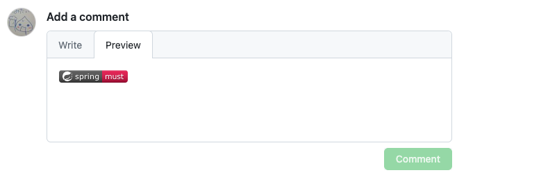
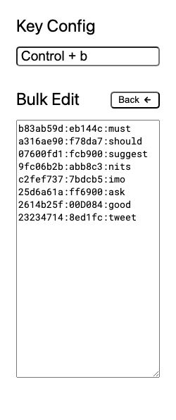

# Badge Palette


GitHub のテキストエリアで [badge](https://shields.io/badges/static-badge) が挿入できるポップアップをひらく Chrome 拡張です。

## スクリーンショット

### 使用例

1️⃣ テキストエリア編集中に `ctrl + Space` でポップアップをひらく


2️⃣ 色まで決まるととじるのでプレビューする



### 選択肢の設定

1️⃣ ブラウザ URL バー付近の Chrome 拡張アイコンをクリック


2️⃣ 選択肢を編集


3️⃣ テキストによる一括編集も可能



✏️ フォーマット

```
random-string:color-hex:text
```

🎨 サンプル

```
b83ab59d:eb144c:must
10b8b58a:fcb900:ask
c2fef737:9900EF:imo
9fc06b2b:abb8c3:nits
2614b25f:00D084:good
23234714:8ed1fc:tweet
bb8b9991:f78da7:suggest
a316ae90:7bdcb5:please
```

## インストール

ストアには公開していません。ご利用はご自身の責任で行ってください。

1️⃣ 本番ビルドをダウンロード ( もしくは下部手順でビルド )

[suzuki-hoge/badge-palette/releases](https://github.com/suzuki-hoge/badge-palette/releases/tag/1.0.0)

2️⃣ 拡張機能ページ ( `chrome://extensions` ) をひらく

3️⃣ `デベロッパーモード` の `パッケージ化されていない拡張機能を読み込む` ボタンをクリック


4️⃣ ダウンロードもしくはビルドした `dist` ディレクトリを選択

## 開発者向け

### 開発ビルド

開発サーバの起動と `dist` ディレクトリの作成

```
$ yarn dev
```

ホットリロードします。

開発サーバを起動していないと拡張機能は動作しません。

### 本番ビルド

`dist` ディレクトリの作成

```
$ yarn build
```
